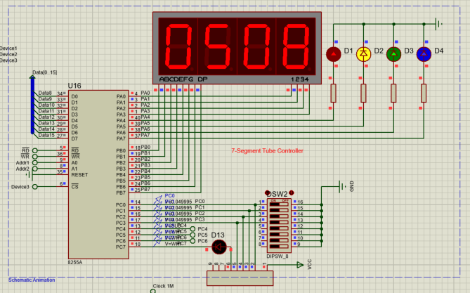
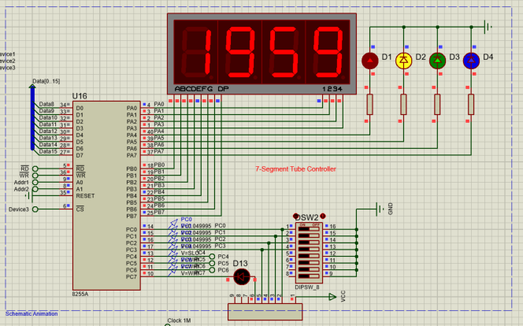
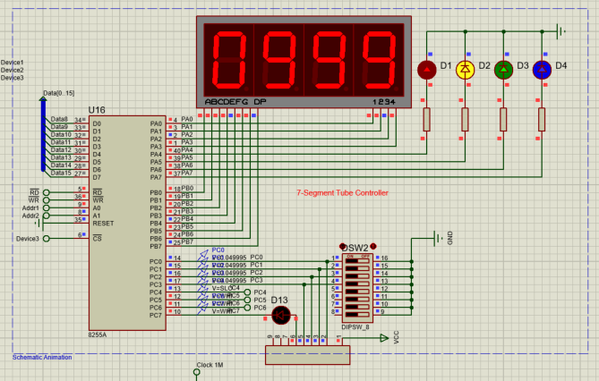

# Report of Final Lab

### Zhicun Chen 518030910173 Zhicun_Chen@sjtu.edu.cn

##  1. Introduction

In this final lab, I will operate a 8086 CPU with 8253 and 8255 component to show some specific information on the 7-segment LED. Generally, I implement several functions to show the data, the time and a count down respectively on 7-segment LED and uses can change the modes by simply pressing the button BT2. Some figures below show the functions that I implemented in this lab.

#### Show Date



#### Show Time



#### Show Count Down



Actually, there is a video file named 'Result.mp4' under this directory, you can check it to have a basic idea about what I have done in this project.

By the way, this project ran perfectly on my own computer, if you have any problem, please feel free to contact me through e-mail to get help.

## 2. How to Use

+ Open file 'finallab.pdsprj'
+ Click the button to run the simulation.
+ Now it will show you the date that I set before.
+ Once you want to change it to Time mode, please press the button BT2 until 7-segment changes to Time mode. Now it shows you the time. You can see it will dynamically change the time.
+ Once you want to change it to Countdown Mode, please press the button BT2 until 7-segment changes to Countdown mode. Now it will show you the count down, You can see it will dynamically change the time.
+ Actually, you can change to any mode by pressing the button BT2 until your expected mode shows on the 7-segment LED since there is a infinite loop to change these three modes.
+ **Attention:** since the program will continuously detect whether the button is pressed, so once you get the mode you want, please quickly release the button, or it may change to the next mode.
+ **Hints:** If you think the time or countdown changes slowly, which makes you wait for a long period of time, you are welcome to change the number 6000 in line 208 in the DisplayTime subroutine which controls how long the time will change. Also, you can change the number 100 in line 271. However, it may cause some unexpected problems.
+ **NOTE:** In my computer, the display part has no blinking problem at all, as you can refer to the video file. So, if you encounter some blinking problems on your computer, it is very possible caused by the difference of the performance.

## 3. Implementation Details

First, I will give you an overview of my implementation.

```flow
st=>start: Start
e=>end: End
op1=>operation: DisplayDate
op2=>operation: DisplayTime
op3=>operation: DisplayCountdown
op4=>operation: repeat all
c1=>condition: Check the button
c2=>condition: Check the button
c3=>condition: Check the button

st->op1->c1
c1(no)->op1
c1(yes)->op2->c2
c2(no)->op2
c2(yes)->op3->c3
c3(no)->op3
c3(yes)->op4
```

And for DisplayDate subroutines, it is the simplest one. The program will show the fixed date on 7-segment LED with the help of the subroutine DisplayDigit.

For DisplayTime, it will first compare *TimerCountDisplay* with 6000(one in *TimerCountDisplay* means 10ms), if *Timer*<6000, then it will just show the time stored in the memory. However, if *Timer*>6000, then it will first change the time stored in the memory. The time is stored in the memory as four independent number for every digit. When it needs to change the time, the program will increase the 4th digit by one. However, it will cause a carry, so there needs some conditional jumps to deal with the carry by some rules I give in the program. Actually, carry can happen at any digit. You can check the DisplayTime subroutine to see how I dealing with carry exception more deeply.

For DisplayCountdown, it will first compare *TimerCountDisplay* with 100. The remaining part actually is quite like what we do in the DisplayTime. However, since we do subtractions in this subroutine, so we need to change the logic to deal with carry into the logic dealing with borrow.

To check whether the button have been pressed, I modify the diagram. I connect a wire from the button's right side, and go through a NOT gate, finally it will connect to PC4. Once the program calls display functions for 10 times, it will check the button's state. First, it will read the input of 8255's port C, and mask all bits except the 5th bit and it will put this value in register CX. If the button is pressed, the value in CX will be non-zero, so we can use the instructions *JCXZ* as the conditional jump. On the other hand, if nothing happens on the button, it will not change the display mode. By the way, since we continuously check the state of the button, so once you get your expected mode, please release the button immediately. You can get the further details by checking my source code.

Finally, I want to share how I resolve a strange bug. When I test my original source code, it may happens that it will just change once in a display mode, for example, it will change from 1000 to 999 and then do not change in the countdown mode. I found it is caused by using the *JZ* instructions. Actually , when I do the comparison, *TimerCountDisplay* may jump the number I set, for example, currently it is 6001 during the comparison, but in the last comparison, it is 5999, it just skip the 6000. Since I will do the conditional jump only when the number is equal to 6000, once it skips 6000, it will never change the time or countdown. I solve this problem by replacing *JZ* by *JLE*.

## 4. Thanks

+ Many thanks to Prof. Leng for his passion in teaching, he really helped me a lot to get a more detailed view of computer organization and assembly programming.
+ Many thanks to all TAs, with their assistance,  I learned more efficiently.
+ Many thanks to all classmates, with their company, I enjoyed the class a lot. 